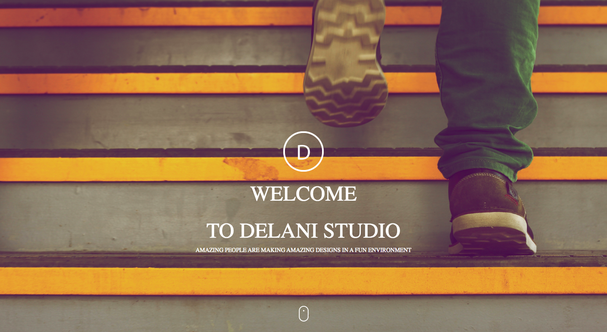
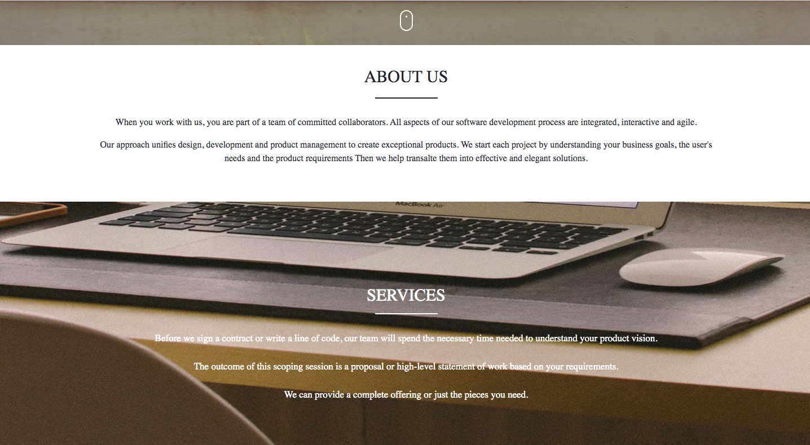
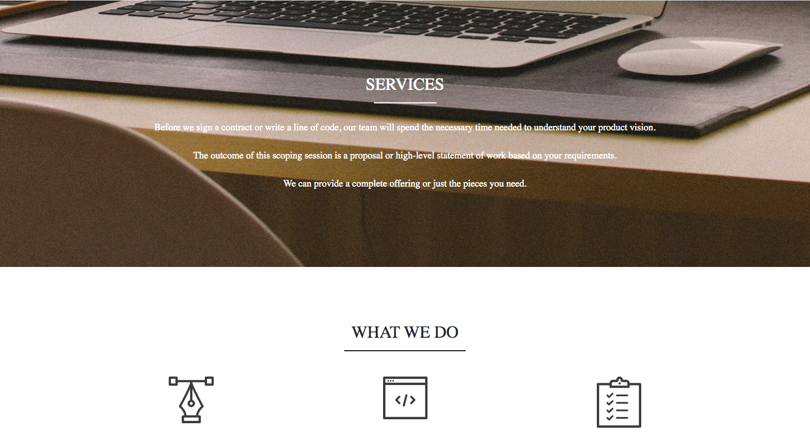
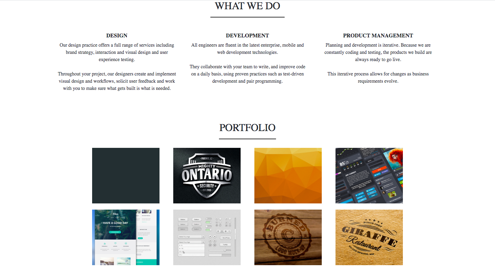
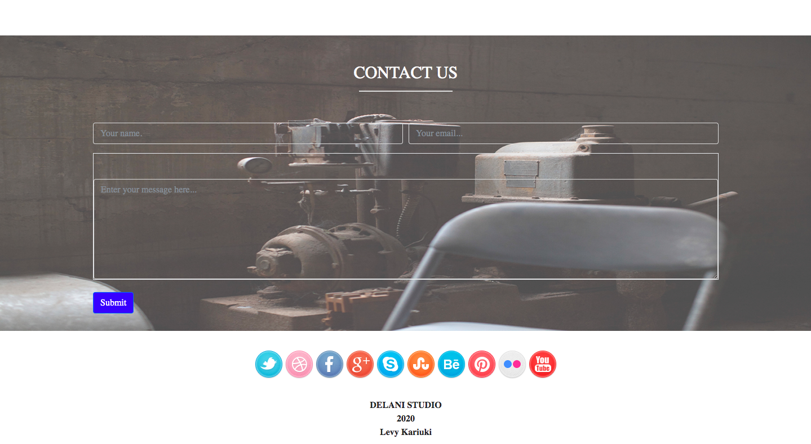

# Delani Studios

Delani Studios is a graphic design studio that helps in designing several business and personal projects.
The website uses an array of Media.

#### Built by: Levy Kariuki

## Getting Started
The website can be cloned to local system through this [link.](https://github.com/levy-jpg/Delani-Studio.git)

### Prerequisites
You need a web browser installed on your machine as well as a text editor in order to view and edit the files effectively.
Examples of text editors:
  * Atom
  * Visual Studio Code

### Installing
Clone the repository to your local machine from the **[online repository]( https://github.com/levy-jpg/Delani-Studio.git)**

### Screenshots

## Built With
* HTML: The markdown language used to add content.
* CSS: Used to style the HTML.
* Bootstrap: Used to style the content in a standardized manner.
* JQUERY: Used to make the web page dynamic and manipulating the DOM.
* Google Fonts: For the font of the webite

## Author's Contact
Email: levthigkari@gamil.com
Number:+25412342318

## License
This software is Licensed under MIT license Copyright (2018) Levy Kariuki
